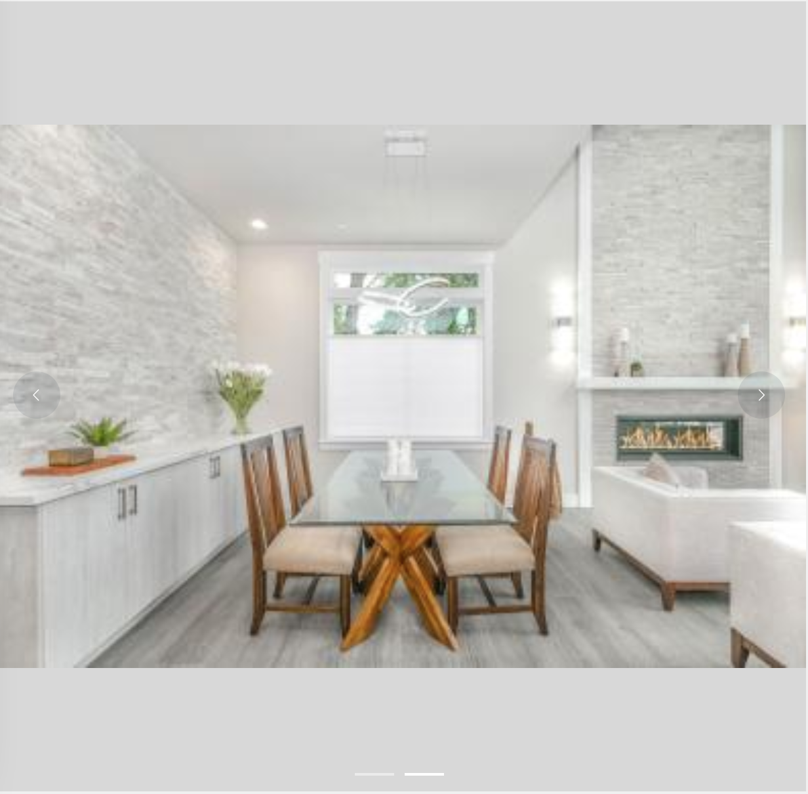

# 记一次el-carousel中自适应图片的技巧 element轮播图的巧用

## 需求： 

图片的高和宽，以数值大的一方为准填充显示
图例，宽的图是上下有灰条，窄的图是左右有灰条



---

## 代码如下

```
<el-carousel trigger="click" class="carousel" arrow="always">
    <el-carousel-item
        v-for="item in productFileList"
        :key="item.id"
        class="carousel"
    >
         item.height"
            :src="item.url"
            style="width: 100%; vertical-align: middle;"
        />
        <span
            v-if="item.width > item.height"
            style="display: inline-block; height: 100%; vertical-align: middle;"
        ></span>
        
        </el-carousel-item>
    </el-carousel>
</el-carousel>
```

## 说明：
productFileList中记录的是图片组，
```
数据结构：
[
    {
        id: "1",
        width: 1200,
        height: 800,
        url: "https:xx.xx.xx.xx/10.jpg"
    },
    {
        id: "2",
        width: 900
        height: 1300,
        url: "https:xx.xx.xx.xx/10.jpg"
    },
]

外层el-carousel样式
.carousel {
  height: calc(100vh - 160px);
}
```
